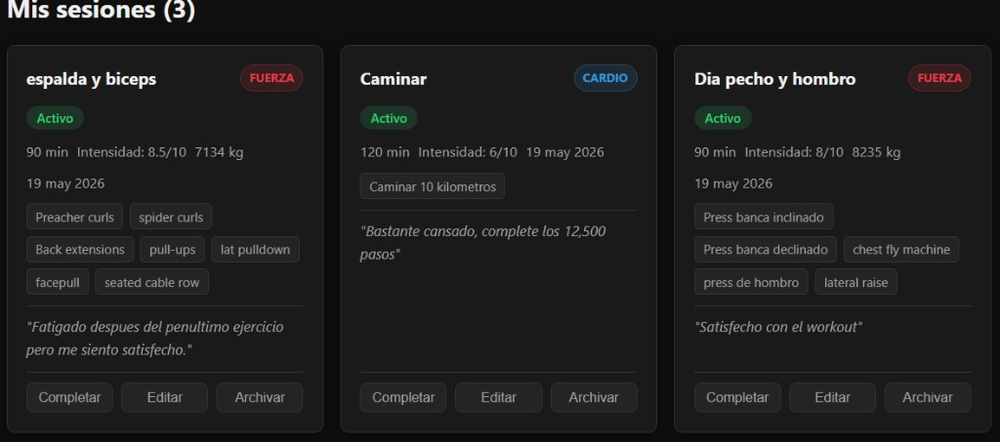
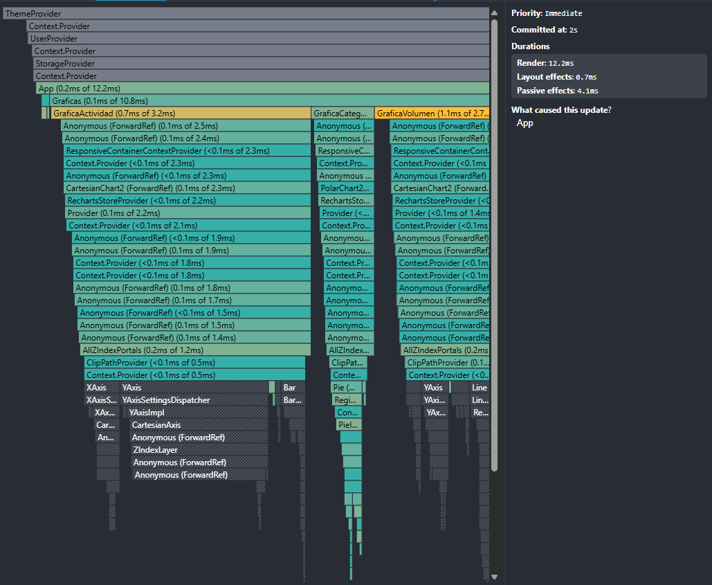
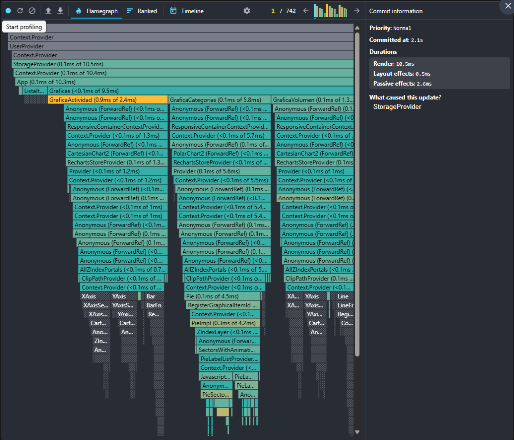

# Mi Entrenamiento — Bitácora de Sesiones

**Proyecto Final · Sistemas y Tecnologías Web · UVG 2026**
**Fase 1:** useState · useEffect · Backend Express
**Fase 2:** useContext · useRef · Tema Visual
**Fase 3:** useReducer · React.memo · Recharts
**Fase 4:** Custom Hooks · Deploy · Video

**Demo:** https://proyecto-fase1.vercel.app
**API:** https://proyecto-fase1.onrender.com
---

## Descripción

Aplicación full-stack para gestionar mi bitácora personal de entrenamiento físico.
Registro sesiones de gym con tipo de entrenamiento, duración, ejercicios realizados e intensidad.

---

## Stack

| Capa          | Tecnología                                       |
|---------------|--------------------------------------------------|
| Frontend      | React 18 + Vite                                  |
| Estado        | useState + useEffect + useContext + useRef        |
| Contextos     | StorageContext + ThemeContext + UserContext        |
| Backend       | Node.js + Express 4                              |
| Base de datos | SQLite (node:sqlite nativo, Node.js 22+)         |
| CORS          | Configurado con variable FRONTEND_URL            |

---

## Cómo correr el proyecto localmente

### Backend

```bash
cd backend
npm install
cp .env.example .env
npm run dev
# → http://localhost:3001
```

### Frontend

```bash
cd frontend
npm install
npm run dev
# → http://localhost:5173
```

---

## Estructura del proyecto

```
proyecto-fase1/
├── frontend/
│   ├── src/
│   │   ├── components/
│   │   │   ├── FormularioItem.jsx
│   │   │   ├── ListaItems.jsx
│   │   │   └── ItemCard.jsx
│   │   ├── context/
│   │   │   ├── StorageProvider.jsx
│   │   │   ├── ThemeProvider.jsx
│   │   │   └── UserProvider.jsx
│   │   ├── utils/
│   │   │   └── categorias.js
│   │   ├── App.jsx
│   │   ├── index.css
│   │   └── main.jsx
│   └── package.json
├── backend/
│   ├── src/
│   │   ├── db/database.js
│   │   ├── routes/items.js
│   │   └── index.js
│   └── package.json
└── .gitignore
```

---

## Endpoints del Backend

| Verbo  | Ruta                    | Descripción                      |
|--------|-------------------------|----------------------------------|
| GET    | /api/items              | Devuelve todos los items activos |
| POST   | /api/items              | Crea una nueva sesión            |
| PUT    | /api/items/:id          | Actualiza una sesión             |
| DELETE | /api/items/:id          | Archiva (soft-delete, activo=0)  |
| POST   | /api/items/:id/registro | Registra minutos de actividad    |

---

## Modelo de datos — Item

| Campo          | Tipo        | Descripción                               |
|----------------|-------------|-------------------------------------------|
| id             | string UUID | crypto.randomUUID()                       |
| nombre         | string      | Nombre de la sesión                       |
| categoriaId    | string      | fuerza / cardio / flexibilidad / ...      |
| estado         | string      | activo / completado / pausa               |
| puntuacion     | number/null | Intensidad 0-10                           |
| fechaRegistro  | string ISO  | Cuándo se creó el item                    |
| fechaActividad | string ISO  | Última interacción                        |
| notas          | string      | Observaciones libres                      |
| atributos      | JSON object | duracionMinutos, ejercicios, volumenTotal |
| activo         | boolean     | false = archivado                         |

---

## Mis primeros Items



| Sesión             | Tipo   | Duración | Intensidad | Ejercicios                                                                                        |
|--------------------|--------|----------|------------|---------------------------------------------------------------------------------------------------|
| Espalda y bíceps   | Fuerza | 90 min   | 8.5/10     | Preacher curls, Spider curls, Back extensions, Pull-ups, Lat pulldown, Facepull, Seated cable row |
| Caminar            | Cardio | 120 min  | 6/10       | Caminar 10 kilómetros                                                                             |
| Día pecho y hombro | Fuerza | 90 min   | 8/10       | Press banca inclinado, Press banca declinado, Chest fly machine, Press de hombro, Lateral raise   |

---

## Mi paleta de colores

### Tema oscuro

| Variable              | Hex       | Justificación                                                                                                                   |
|-----------------------|-----------|---------------------------------------------------------------------------------------------------------------------------------|
| `--color-fondo`       | `#0f0f0f` | Negro casi puro para reducir fatiga visual en sesiones nocturnas de registro. Contrasta fuertemente con los elementos sobre él. |
| `--color-superficie`  | `#1a1a1a` | Gris muy oscuro para diferenciar cards del fondo sin usar un color llamativo. Da profundidad sin distraer.                      |
| `--color-texto`       | `#f0f0f0` | Blanco suavizado (no puro) para evitar el contraste agresivo blanco sobre negro que causa fatiga ocular.                        |
| `--color-texto-suave` | `#a0a0a0` | Gris medio para información secundaria como fechas y metadatos, sin competir con el texto principal.                            |
| `--color-acento`      | `#e63946` | Rojo vibrante asociado al esfuerzo físico y la intensidad del entrenamiento. Color principal de la marca.                       |
| `--color-exito`       | `#2ecc71` | Verde para estados positivos (completado, guardado). Convención universal de éxito en interfaces.                               |

### Tema claro

| Variable              | Hex       | Justificación                                                                                                                   |
|-----------------------|-----------|---------------------------------------------------------------------------------------------------------------------------------|
| `--color-fondo`       | `#f5f5f5` | Gris muy claro en vez de blanco puro para reducir el brillo excesivo en ambientes iluminados.                                   |
| `--color-superficie`  | `#ffffff` | Blanco puro para las cards, creando contraste claro contra el fondo gris y resaltando el contenido.                             |
| `--color-texto`       | `#1a1a1a` | Negro suavizado para el texto principal. Más legible que el negro puro en fondos blancos.                                       |
| `--color-texto-suave` | `#555555` | Gris oscuro para información secundaria, manteniendo legibilidad sin el peso del texto principal.                               |
| `--color-acento`      | `#c0392b` | Versión más oscura del rojo para el tema claro, garantizando contraste suficiente sobre fondos blancos.                         |
| `--color-exito`       | `#27ae60` | Verde ligeramente más oscuro que en tema oscuro para mantener contraste adecuado sobre fondo claro.                             |


*UVG · STW 2026 · Fase 2 de 4*

---

## Mi gráfica original

La tercera gráfica (un LineChart) muestra el **volumen total levantado (kg) por sesión**.

Decidí usarla porque el volumen total es la métrica más importante para medir el progreso en el gimnasio. Ver la línea en cada entrenamiento me permite saber fácilmente si estoy subiendo mis pesos, si me estanqué, o qué sesiones fueron las más pesadas.

---

## Mis 3 decisiones técnicas

**1. Filtros y lista en un mismo Reducer**

Preferí meter los filtros (búsqueda, categoría, estado) en el mismo reducer de la lista en lugar de usar varios `useState`. Así, con una sola acción (`LIMPIAR_FILTROS`) puedo limpiar todo de un solo sin provocar varios re-renders innecesarios en la aplicación.

**2. Mantener puro el Reducer (REGISTRAR_ACTIVIDAD)**

Esta acción fue la que más me costó porque un reducer no debe tener efectos secundarios (como calcular fechas o conectarse a un API). Para solucionarlo, mejor genero la fecha actual en `App.jsx` y se la paso ya calculada en el payload. Así el reducer solo se encarga de actualizar el dato.

**3. Datos de la gráfica de Volumen**

Preparar esta gráfica fue complejo porque el dato del volumen viene adentro de un JSON anidado. Tuve que hacer un `.filter()` para quitar las sesiones de cardio (que no usan peso), un `.sort()` para ordenarlo todo por fecha y un `.map()` para que la gráfica de Recharts lo pudiera leer bien.

---

## Evidencia Profiler

### Antes de optimizar (sin useMemo / React.memo)


### Después de optimizar (con useMemo / React.memo)


**Análisis: ¿Qué componentes dejaron de re-renderizarse?**

Al escribir en el buscador:
- **Antes:** Cada letra que tecleaba forzaba a que toda la aplicación se volviera a renderizar. Esto hacía que el componente de **`Graficas`** (que es pesado) y todas las **`ItemCard`** se actualizaran por gusto en cada teclazo, aunque sus datos no hubieran cambiado.
- **Después:** Gracias a que implementé `useMemo`, `useCallback` y envolví las tarjetas con `React.memo`, el Profiler muestra que ahora esos componentes se omiten (salen en gris). Es decir, **`Graficas`** y las **`ItemCard`** que no cambian dejaron de re-renderizarse por completo, haciendo que la aplicación se sienta mucho más rápida.

*UVG · STW 2026 · Fase 3 de 4*

## Hooks implementados

| Hook               | Archivo                       | Que hace                                                        |
|--------------------|-------------------------------|-----------------------------------------------------------------|
| useLocalStorage    | src/hooks/useLocalStorage.js  | Sincroniza estado con localStorage usando useState + useEffect  |
| useFetch           | src/hooks/useFetch.js         | Fetch con estados data/cargando/error y AbortController         |
| useAtajoTeclado    | src/hooks/useAtajoTeclado.js  | Registra atajos de teclado con cleanup automatico               |
| useRacha           | src/hooks/useRacha.js         | Calcula racha actual y racha mas larga de dias entrenados        |

---

## Screenshots


## Sobre mi

**Nombre:** Enrique Bran
**Carne:** 25302
**Semestre:** actual

Hacer este proyecto me sirvió bastante para aprender a estructurar una aplicación en React de forma escalable, separando bien las responsabilidades entre los contextos, el reducer y los custom hooks. Antes usaba `useState` para todo y no me explicaba por qué los componentes se volvían a renderizar por gusto. Aprender a implementar `useReducer`, `useMemo` y `useCallback` me dio las herramientas precisas para cuidar el rendimiento, y los custom hooks me enseñaron cómo reutilizar la lógica sin tener que andar duplicando código entre los componentes.

---

*UVG - STW 2026 - Fase 4 de 4*